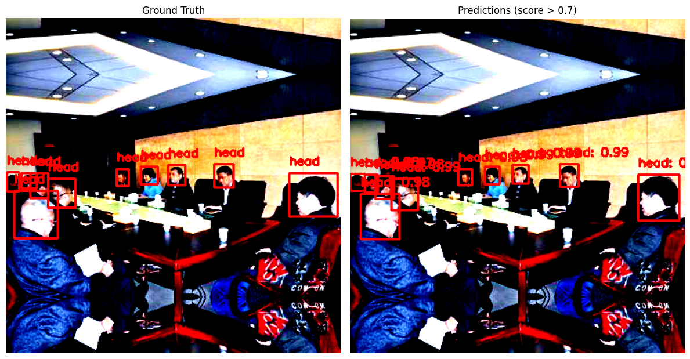
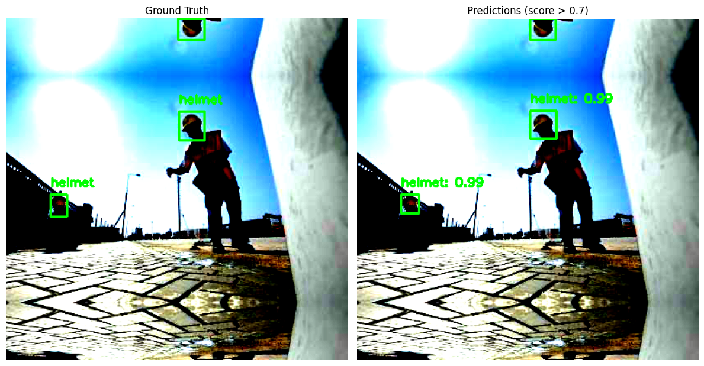

# Safety Helmet Object Detection

This project focuses on detecting safety helmets in workplace images using a deep learning–based object detection pipeline.

The model is designed to detect two object categories:

- `helmet`
- `head`

The main goal is to support worker safety compliance analysis by identifying whether a helmet is present in annotated scene images.

## Overview

The project uses a **Faster R-CNN with ResNet-50 FPN** architecture for object detection.
A custom pipeline was built with **PyTorch** and **Torchvision** for data preparation, training, evaluation, and visualization.

The dataset consists of **5,000 annotated images** with XML bounding box labels. After filtering valid samples, the data was split into:

- **3,000** training images
- **1,000** validation images
- **1,000** test images

## Model

The detector is based on:

- **Faster R-CNN**
- **ResNet-50 backbone**
- **Feature Pyramid Network (FPN)**
- **Transfer learning with a custom detection head**

## Data Processing

The notebook includes:

- XML annotation parsing
- bounding box extraction
- custom PyTorch dataset creation
- train / validation / test split
- image resizing and normalization
- data augmentation for training

Applied augmentation includes:

- horizontal flip
- random brightness / contrast adjustment

## Evaluation

The model was evaluated on the held-out test set using **mAP@0.5**.

### Test Results

- **mAP@0.5:** `0.9538`
- **AP (helmet):** `0.9655`
- **AP (head):** `0.9422`

## Sample Outputs

Below are example prediction visualizations from the notebook.

### Example 1



### Example 2



## Project Structure

```bash
Safety-Helmet-Object-Detection/
│── Safety_Helmet_Object_Detection_FasterRCNN.ipynb
│── output_1.png
│── output_2.png
│── requirements.txt
│── README.md
```

## Technologies Used

- Python
- PyTorch
- Torchvision
- OpenCV
- Albumentations
- NumPy
- Matplotlib
- scikit-learn

## How to Run

1. Clone the repository:

```bash
git clone https://github.com/giraydorukyurt7/Safety-Helmet-Object-Detection.git
cd Safety-Helmet-Object-Detection
```

2. Install dependencies:

```bash
pip install -r requirements.txt
```

3. Open the notebook:

```bash
jupyter notebook Faster_RCNN3.ipynb
```

4. Update dataset paths in the notebook and run the cells step by step.

## Notes

- The current implementation is notebook-based.
- The project includes both training and inference stages in a single workflow.
- Prediction visualizations are generated directly inside the notebook.

## Future Improvements

- export inference into a standalone Python script
- add more real-world safety scene examples
- improve repository structure beyond a notebook-only workflow
- test on more diverse and challenging images

## Author

**Giray Doruk Yurtseven**  
Software Engineering Student | AI, Computer Vision, and Backend Development

- LinkedIn: https://www.linkedin.com/in/giraydorukyurt7
- GitHub: https://github.com/giraydorukyurt7
